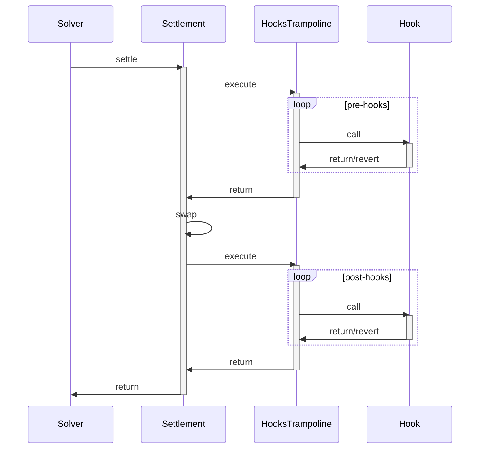

# CoW Protocol Offline Playground

A self-contained, offline development environment for CoW Protocol that runs locally without requiring mainnet forks or archive nodes.

## Table of Contents

- [Offline Mode](#offline-mode)
- [Quick Start](#quick-start)
- [Known Issues](#known-issues)
- [Testing](#testing)
  - [Integration Tests](#integration-tests)
  - [ComposableCow Conditional Orders](#composablecow-conditional-orders)
- [Manual Order Scripts](#manual-order-scripts)
- [Architecture](#architecture)
- [Mock Services](#mock-services)
- [Hooks](#hooks)
  - [Developing Custom Hooks](#developing-custom-hooks)
- [Configuration](#configuration)
- [Known Limitations](#known-limitations)
- [Troubleshooting](#troubleshooting)
- [Development Workflow](#development-workflow)

## Offline Mode

The CoW Protocol Offline Playground is a complete local blockchain environment that includes:

- **Local Anvil node** with persistent state at block 12593265
- **CoW Protocol contracts**: Settlement, VaultRelayer, Authenticator, HooksTrampoline
- **CoWShed**: Proxy factory for Smart Contract Wallets
- **Safe Wallet**: Full Safe infrastructure deployed
- **ComposableCow**: Conditional orders (TWAP, StopLoss, GoodAfterTime, etc.)
- **DEX infrastructure**: Uniswap V2 with liquidity pools
- **Test tokens**: WETH, USDC, DAI, USDT, GNO (at mainnet addresses)
- **CoW Protocol services**: Orderbook API, Autopilot, Driver, Baseline Solver, Watch-tower
- **Mock services**: Coingecko price API, Chainlink price oracles

All services work out-of-the-box with proper configuration pointing to the local blockchain.

## Quick Start

### Prerequisites

- Docker and Docker Compose
- Git
- Node.js 18+ and npm
- **Foundry** (required for running tests)

#### Installing Foundry

Foundry is required to run the test suite (`npm test`). Install it using foundryup:

```bash
# Install foundryup
curl -L https://foundry.paradigm.xyz | bash

# Install Foundry (forge, cast, anvil, chisel)
foundryup
```

Verify installation:
```bash
cast --version
```

For more details, see [Foundry Book](https://book.getfoundry.sh/getting-started/installation)

### Setup

1. **Clone the repository with submodules**:
   ```bash
   git clone --recurse-submodules https://github.com/cowdao-grants/offline-mode.git
   cd offline-mode
   ```

   If you already cloned without submodules, initialize them:
   ```bash
   git submodule init
   git submodule update
   ```

2. **Configure Mainnet RPC URL**:

   ⚠️ **IMPORTANT**: The deployment process fetches contract bytecode from Ethereum mainnet. You **must** configure a valid Alchemy RPC URL in the `.env` file:

   ```bash
   # Open .env and update this line with your Alchemy API key:
   MAINNET_RPC_URL=https://eth-mainnet.g.alchemy.com/v2/YOUR_ALCHEMY_API_KEY
   ```

   Get a free Alchemy API key at [https://www.alchemy.com/](https://www.alchemy.com/)

   **Why this is needed:** During deployment, the chain-deployer fetches bytecode for contracts like Balances Helper, Signatures, and other auxiliary contracts from mainnet to deploy them at their deterministic addresses locally.

3. **Install Node.js dependencies**:
   ```bash
   npm install --legacy-peer-deps
   ```

   The `--legacy-peer-deps` flag is required to resolve dependency conflicts in the project.

### Initialize the Environment

1. **Start all services**:
   ```bash
   docker-compose up -d
   ```

   On first run, the `chain-deployer` service will automatically:
   - Start a temporary Anvil instance
   - Deploy all contracts (tokens, Uniswap V2, CoW Protocol, ComposableCow, Safe, etc.)
   - Add liquidity to Uniswap pairs
   - Fund test user wallets
   - Deploy mock Chainlink oracles
   - Generate configuration files
   - Save the blockchain state to `state/anvil-state.json`
   - Start the Anvil node with the deployed state

   On subsequent runs, the chain-deployer will detect the existing state and skip deployment, immediately starting the Anvil node with the saved state.

2. **Wait for services to be ready**:
   ```bash
   # Wait for orderbook API to be available
   curl --retry 24 --retry-delay 5 --retry-all-errors http://localhost:8080/api/v1/version
   ```

3. **Run tests**:

   ⚠️ **IMPORTANT**: Make sure you have [Foundry installed](#installing-foundry) before running tests. The test suite uses `cast` to interact with the blockchain.

   ```bash
   npm test
   ```

### Access Points

Once running, you can access:

- **Orderbook API**: http://localhost:8080
- **Anvil RPC**: http://localhost:8545
- **Grafana (monitoring)**: http://localhost:3000
- **Prometheus (metrics)**: http://localhost:9090
- **Adminer (database)**: http://localhost:8082
- **Frontend (CoW Swap)**: http://localhost:8000
- **Explorer**: http://localhost:8001

### Running with Custom Ports

If you need to run multiple instances or avoid port conflicts, you can easily configure all ports with an offset:

```bash
# Set all ports with an offset of 500
npm run set-ports 500
docker-compose up -d
```

Example output:
```
🔧 Setting ports with offset: 500
✅ Ports configured:
   CHAIN           9045
   ORDERBOOK       8580
   ORDERBOOK METRICS 10086
   ORDERBOOK TOKIO 7169
   ADMINER         8582
   DB              5932
   AUTOPILOT METRICS 10089
   AUTOPILOT TOKIO 7170
   DRIVER          9500
   DRIVER TOKIO    7171
   BASELINE        9501
   BASELINE TOKIO  7172
   FRONTEND        8500
   EXPLORER        8501
   GRAFANA         3500
   PROMETHEUS      9590
   TEMPO           4817

💡 Now run: docker-compose up -d
```

With offset 500, all services will run on shifted ports:

**User-facing services:**
- Anvil RPC: 9045 (8545 + 500)
- Orderbook API: 8580 (8080 + 500)
- Adminer: 8582 (8082 + 500)
- PostgreSQL: 5932 (5432 + 500)
- Frontend: 8500 (8000 + 500)
- Explorer: 8501 (8001 + 500)
- Grafana: 3500 (3000 + 500)
- Prometheus: 9590 (9090 + 500)

**Debugging/Testing services:**
- Driver API: 9500 (9000 + 500)
- Baseline API: 9501 (9001 + 500)
- Orderbook Metrics: 10086 (9586 + 500)
- Autopilot Metrics: 10089 (9589 + 500)
- Tempo OTLP: 4817 (4317 + 500)
- Tokio Console ports: 7169-7172 (6669-6672 + 500)

**Reset to default ports:**

```bash
npm run set-ports 0
docker-compose up -d
```

**How it works:**

The `npm run set-ports <offset>` command updates the individual `PORT_*` variables in your `.env` file with calculated values. Since `.env` is in `.gitignore`, your port configuration won't be committed to git. Docker Compose automatically reads these port values from `.env`.

## Testing

### Integration Tests

The playground includes comprehensive Jest integration tests for CoW Protocol orders.

#### Running Tests

**⚠️ IMPORTANT:**
- You must have the Docker Compose services running before running tests!
- **Foundry must be installed** on your system (see [Installing Foundry](#installing-foundry))
- The test suite uses `cast` to refresh oracle timestamps before running

```bash
# Start services
docker-compose up -d

# Wait for services
curl --retry 24 --retry-delay 5 --retry-all-errors http://localhost:8080/api/v1/version

# Run all tests
npm test

# Run specific test suites
npm run test:orders         # Regular limit/market orders
npm run test:composable-cow # ComposableCow conditional orders
npm run test:cowshed        # Safe wallet with hooks tests
```

#### What Gets Tested

**Limit Orders (Sell Orders)**
- DAI → WETH swap
- USDC → DAI swap
- Verifies balances change correctly
- Waits for settlement (up to 2 minutes)

**Market Orders (Buy Orders)**
- Buy exact amounts of tokens
- Handles fee calculations
- Verifies exact buy amounts received

**Safe Wallet Trading**
- Orders from Safe wallet proxies
- Pre-hooks execution via HooksTrampoline
- Post-hooks execution
- EIP-712 signature validation

**Test Configuration**
- **Default Timeout:** 2 minutes per test
- **ComposableCow Test Timeout:** 15 minutes
- **Test Runner:** Jest with ts-jest
- **Test Wallets:**
  - Regular orders use Anvil accounts #1 and #2
  - Safe wallet tests use deployed Safe from `TEST_USER_SAFE_ADDRESS`

### ComposableCow Conditional Orders

ComposableCow enables **conditional orders** (programmatic orders) that execute automatically when specific conditions are met. These tests validate the full end-to-end flow:

1. Order creation through ComposableCow
2. Watch-tower detection and monitoring
3. Discrete order generation when conditions are met
4. Order settlement through CoW Protocol

#### Order Types

**TWAP (Time-Weighted Average Price)**
- Sells a large amount over time in smaller parts
- Reduces market impact
- Example: Selling 30 DAI → WETH in 3 parts over 15 minutes

```bash
npm run test:composable-cow:twap
```

**Parameters:**
- `partSellAmount`: Amount per part
- `n`: Number of parts
- `t`: Time between parts
- `t0`: Start time

**When it executes:** At each time interval (t0, t0+t, t0+2t, ...)

**Stop-Loss**
- Automatically sells when price drops below a threshold
- Protects against downside risk
- Example: Sell 1 WETH if price drops below $2500

```bash
npm run test:composable-cow:stop-loss
```

**Parameters:**
- `strike`: Price threshold
- `sellAmount`: Amount to sell
- `buyAmount`: Minimum to receive

**When it executes:** When oracle price drops to or below strike price

**GoodAfterTime** ⚠️ Not Working in Offline Mode
- Order becomes valid only after a specific timestamp
- Would be useful for scheduled trades
- See [Known Limitations](#known-limitations) for details

#### Understanding Results

**✅ Successful Execution**
```
✅ Conditional order created in block 12345
ℹ️  Order owner: 0x7099... (EOA)
✅ Order executed!
Final Balances:
   DAI: 70.0 (Δ -30.0)
   WETH: 0.015 (Δ +0.015)
```

**⏱️ Timeout (Expected for some tests)**
```
⏱️  Timeout reached. Order not executed within monitoring period.
ℹ️  This is expected if conditions haven't been met yet.
```

This is normal for:
- **Stop-Loss**: If market price hasn't hit the strike
- **TWAP**: If all parts haven't executed yet
- **GoodAfterTime**: Doesn't work in offline mode (see limitations)

#### Debugging Conditional Orders

Enable verbose logging:
```bash
# Watch-tower logs
docker logs offline-mode-watch-tower-1 -f

# Chain-deployer logs
docker logs offline-mode-chain-deployer-1 -f

# Orderbook logs
docker logs offline-mode-orderbook-1 -f
```

## Manual Order Scripts

The playground includes standalone scripts for manually creating and submitting orders. These scripts are useful for:
- Interactive testing and debugging
- Understanding order creation flow
- Experimenting with different order types and parameters
- Demo purposes

**Note:** These scripts are **not** Jest tests. They create real orders on the running playground environment.

### Prerequisites

Before running any order scripts:

1. **Services must be running:**
   ```bash
   docker-compose up -d
   ```

2. **Wait for services to be ready:**
   ```bash
   curl --retry 24 --retry-delay 5 --retry-all-errors http://localhost:8080/api/v1/version
   ```

### Available Scripts

#### 1. Playground Order (Regular Orders)

**Script:** `scripts/orders/playground-order.ts`

Creates a regular CoW Protocol order with customizable parameters.

**Usage:**
```bash
npm run order:playground -- [options]
```

**Options:**
- `--sellToken <TOKEN>` - Token to sell (WETH, USDC, DAI, USDT, or GNO)
- `--buyToken <TOKEN>` - Token to buy (WETH, USDC, DAI, USDT, or GNO)
- `--sellAmount <AMOUNT>` - Amount to sell (e.g., `10e18`, `1000e6`) - use this OR `--buyAmount`
- `--buyAmount <AMOUNT>` - Amount to buy (e.g., `10e18`, `1000e6`) - use this OR `--sellAmount`
- `--from <PRIVATE_KEY>` - Trader private key (defaults to Anvil account #1)
- `--surplus <PERCENT>` - Surplus percentage (default: 3%)
- `-h, --help` - Show help

**Examples:**

Sell 10 GNO for WETH:
```bash
npm run order:playground -- --sellToken GNO --buyToken WETH --sellAmount 10e18
```

Buy exactly 100 DAI with USDC:
```bash
npm run order:playground -- --sellToken USDC --buyToken DAI --buyAmount 100e18
```

With custom private key and surplus:
```bash
npm run order:playground -- \
  --sellToken WETH --buyToken DAI --sellAmount 1e18 \
  --surplus 5 \
  --from 0x59c6995e998f97a5a0044966f0945389dc9e86dae88c7a8412f4603b6b78690d
```

**What it does:**
1. Funds the trader with sell tokens (if needed)
2. Approves VaultRelayer to spend tokens
3. Gets a quote from the orderbook
4. Signs the order with EIP-712
5. Submits the order to the orderbook
6. Monitors for settlement (up to 2 minutes)
7. Displays final balances

#### 2. CoWShed Order (Safe Wallet with Hooks)

**Script:** `scripts/orders/cowshed-order.ts`

Demonstrates trading from a Safe wallet with pre-hooks and post-hooks.

**Usage:**
```bash
npm run order:cowshed
```

**Parameters:** None (uses hardcoded configuration)

**What it does:**
1. Calculates the CoWShed proxy address for the user
2. Creates a pre-hook (transfers 10 DAI to a recipient)
3. Creates an order selling DAI for WETH
4. Includes hooks in the order's appData
5. Signs with EIP-712 (EOA signature)
6. Submits to orderbook
7. Monitors for settlement
8. Verifies hooks executed correctly

**Key Concepts:**
- Order is signed by EOA (Anvil account #1), not the Safe
- Assets stay in EOA, not transferred to Safe
- Hooks execute permissioned actions via HooksTrampoline
- Demonstrates correct use of `transferFrom` in hooks

#### 3. TWAP Order (Time-Weighted Average Price)

**Script:** `scripts/orders/composable-cow/twap.ts`

Creates a TWAP conditional order that splits a large trade into smaller parts over time.

**Usage:**
```bash
npm run order:composable-cow:twap
```

**Parameters:** None (uses hardcoded configuration)

**Default Configuration:**
- Sells 30 DAI for WETH
- Split into 3 parts (10 DAI each)
- 5 minutes between parts
- Each part valid for 5 minutes
- Starts 10 seconds after creation

**What it does:**
1. Uses Safe wallet (from `TEST_USER_SAFE_ADDRESS` env var)
2. Funds Safe with DAI
3. Approves VaultRelayer to spend from Safe
4. Creates TWAP order via ComposableCow contract
5. Monitors for watch-tower to detect and post parts
6. Waits for each part to settle
7. Displays progress and final balances

**Timeline:**
```
T+0s:   Create TWAP order
T+10s:  Part 1 becomes valid → Watch-tower posts → Settlement
T+310s: Part 2 becomes valid → Watch-tower posts → Settlement
T+610s: Part 3 becomes valid → Watch-tower posts → Settlement
```

**Note:** Monitoring timeout is 15 minutes (enough for all 3 parts).

#### 4. Stop-Loss Order

**Script:** `scripts/orders/composable-cow/stop-loss.ts`

Creates a stop-loss conditional order that executes when price drops below a threshold.

**Usage:**
```bash
npm run order:composable-cow:stop-loss
```

**Parameters:** None (uses hardcoded configuration)

**Default Configuration:**
- Sells 1 WETH when price drops below $2500
- Uses mock Chainlink oracles
- Minimum receive: Equivalent DAI/USDC at strike price

**What it does:**
1. Uses Safe wallet
2. Funds Safe with WETH
3. Creates stop-loss order via ComposableCow
4. Watch-tower monitors oracle prices
5. When price hits strike, watch-tower posts order
6. Order settles automatically
7. Displays results

**Note:** In offline mode, oracle prices are fixed (see Mock Chainlink Oracles section). To test, you'd need to modify mock oracle prices.

#### 5. Good After Time Order (⚠️ Not Working)

**Script:** `scripts/orders/composable-cow/good-after-time.ts`

**Status:** ⚠️ This script exists but **does not work** in offline mode.

See [Known Limitations](#known-limitations) section for details on why GoodAfterTime orders don't work.

### Monitoring Order Execution

All scripts monitor order settlement automatically, but you can also check manually:

**Check order status:**
```bash
curl http://localhost:8080/api/v1/orders/<ORDER_UID>
```

**Watch orderbook logs:**
```bash
docker-compose logs orderbook -f
```

**Watch autopilot logs:**
```bash
docker-compose logs autopilot -f
```

**Watch baseline solver logs:**
```bash
docker-compose logs baseline -f
```

### Troubleshooting Scripts

**Script hangs at "Waiting for settlement":**
- Restart baseline solver: `docker-compose restart baseline`
- Check if services are running: `docker-compose ps`
- Verify token approvals were set
- Ensure enough surplus (at least 3%)

**"Insufficient balance" errors:**
- Scripts automatically fund accounts, but check if deployment succeeded
- Verify Uniswap pools have liquidity
- Check token addresses in `.env`

**ComposableCow scripts fail:**
- Ensure ComposableCow contracts are deployed: Check `.env` for addresses
- Verify watch-tower is running: `docker-compose ps watch-tower`
- Check watch-tower logs: `docker-compose logs watch-tower`
- Ensure Safe wallet is deployed: Check `TEST_USER_SAFE_ADDRESS` in `.env`

**"Network error" or "Connection refused":**
- Services not running: `docker-compose up -d`
- Services not ready yet: Wait 30 seconds and retry
- Check orderbook health: `curl http://localhost:8080/api/v1/version`

### Customizing Scripts

To modify script behavior, edit the script file directly:

**Example: Change TWAP parameters:**
```typescript
// In scripts/orders/composable-cow/twap.ts

const twapConfig = {
  partSellAmount: ethers.parseEther('20'),  // 20 DAI per part (was 10)
  n: 5,                                      // 5 parts (was 3)
  t: 600,                                    // 10 minutes between parts (was 5)
  t0: Math.floor(Date.now() / 1000) + 60,  // Start in 60 seconds (was 10)
  // ...
};
```

After modifying, run the script again:
```bash
npm run order:composable-cow:twap
```

## Architecture

```
┌─────────────────┐
│  Anvil (31337)  │  ← Local blockchain with persistent state
└────────┬────────┘
         │
    ┌────┴─────────────────────────────────┐
    │                                       │
┌───▼────────┐                    ┌────────▼──────┐
│   Tokens   │                    │  DEX Contracts │
│ WETH, USDC │                    │   Uniswap V2   │
│ DAI, USDT  │                    │  (with pools)  │
│    GNO     │                    └────────────────┘
└────────────┘                             │
                                           │
         ┌─────────────────────────────────┤
         │                                 │
    ┌────▼──────────┐          ┌──────────▼──────┐
    │  CoW Protocol │          │ ComposableCow   │
    │   Settlement  │          │  (Conditional   │
    │ VaultRelayer  │          │    Orders)      │
    │HooksTrampoline│          └─────────────────┘
    └───────┬───────┘
            │
    ┌───────┴──────────────────────────────┐
    │                                       │
┌───▼─────┐  ┌──────────┐  ┌──────┐  ┌────▼────┐
│Orderbook│  │Autopilot │  │Driver│  │Baseline │
│   API   │  │          │  │      │  │ Solver  │
└─────────┘  └──────────┘  └──────┘  └─────────┘
                                            │
                                      ┌─────▼──────┐
                                      │Watch-tower │
                                      │ (monitors  │
                                      │conditional)│
                                      └────────────┘
```

### Conditional Orders Flow

```
┌─────────────────┐
│  Test Script    │
│  (TypeScript)   │
└────────┬────────┘
         │ create()
         ↓
┌─────────────────┐
│  ComposableCow  │  ← On-chain contract
│   Contract      │
└────────┬────────┘
         │ ConditionalOrderCreated event
         ↓
┌─────────────────┐
│  Watch-Tower    │  ← Monitors & generates orders
│   Service       │
└────────┬────────┘
         │ POST /api/v1/orders
         ↓
┌─────────────────┐
│  Orderbook API  │  ← Validates & stores orders
└────────┬────────┘
         │
         ↓
┌─────────────────┐
│    Solvers      │  ← Find best execution
└────────┬────────┘
         │
         ↓
┌─────────────────┐
│  Settlement     │  ← Executes trades on-chain
│   Contract      │
└─────────────────┘
```

## Mock Services

This playground includes mock implementations of external services for offline development.

### Coingecko Mock API

Mock implementation of the Coingecko API for price fetching.

- **Technology**: Node.js + TypeScript + Hono API
- **Endpoint**: `http://localhost:3001/api/v3/simple/token_price/ethereum`
- **Purpose**: Provides configurable token prices in ETH denomination

**Supported Tokens:**

| Symbol | Address | Price (ETH) |
|--------|---------|-------------|
| WETH   | 0xC02aaA39b223FE8D0A0e5C4F27eAD9083C756Cc2 | 1.0 |
| DAI    | 0x6B175474E89094C44Da98b954EedeAC495271d0F | 0.0004 |
| USDC   | 0xA0b86991c6218b36c1d19D4a2e9Eb0cE3606eB48 | 0.0004 |
| USDT   | 0xdAC17F958D2ee523a2206206994597C13D831ec7 | 0.0004 |
| GNO    | 0x6810e776880C02933D47DB1b9fc05908e5386b96 | 0.05 |

**Example Request:**
```bash
curl "http://localhost:3001/api/v3/simple/token_price/ethereum?contract_addresses=0xc02aaa39b223fe8d0a0e5c4f27ead9083c756cc2&vs_currencies=eth&precision=full"
```

**Configuration:**
To modify token prices, edit `mocks/coingecko/src/tokens.config.ts` and rebuild the service.

### Mock Chainlink Oracles

The playground deploys mock Chainlink price feed contracts for Stop-Loss conditional orders:

- **WETH/USD**: $3000
- **DAI/USD**: $1.00
- **USDC/USD**: $1.00
- **USDT/USD**: $1.00
- **GNO/USD**: $100

Oracle addresses are automatically saved to `.env` during deployment.

## Hooks

Hooks are a CoW Protocol feature that allow traders to specify custom Ethereum calls as part of their order to get executed atomically in the same transaction as they trade.

### HooksTrampoline Contract

The `HooksTrampoline` contract (deployed at `0x60Bf78233f48eC42eE3F101b9a05eC7878728006`) protects the protocol from:

1. **Executing calls from privileged context**: Hooks run from HooksTrampoline, not from the settlement contract, preventing unauthorized access to settlement contract funds.

2. **Reverting settlements**: Hooks execute with a gas limit and can revert without affecting the settlement or other orders.

### How Hooks Work



### Using Hooks

Hooks are specified in the order's `appData` JSON:

```typescript
const appData = {
  version: "1.1.0",
  metadata: {
    hooks: {
      pre: [
        {
          target: "0xYourHookContract",
          callData: "0x...",
          gasLimit: "100000"
        }
      ],
      post: []
    }
  }
};
```

### Developing Custom Hooks

⚠️ **CRITICAL: Use `transferFrom`, NOT `transfer`**

When your hook needs to move tokens, you **MUST** use `transferFrom`:

```solidity
// ✅ CORRECT - HooksTrampoline uses delegatecall
IERC20(sellToken).transferFrom(trader, recipient, amount);

// ❌ WRONG - Will fail silently, no tokens transferred
IERC20(sellToken).transfer(recipient, amount);
```

**Why this matters:**

HooksTrampoline executes your hook via `delegatecall`, which means:
- The code runs in the **settlement contract's context**, not your hook contract
- `msg.sender` is the **settlement contract**, not your hook or the trader
- Your hook contract has **no token balance** to transfer from
- You must **pull tokens from the trader's address** using `transferFrom`

**What happens if you use `transfer`:**
- ❌ Order settles successfully (no revert)
- ❌ Hook appears to execute (included in transaction)
- ❌ But **no tokens are actually transferred** by the hook
- ❌ Very difficult to debug - everything looks fine in logs!

**Requirements for your hook:**

1. **Trader must approve HooksTrampoline** to spend tokens:
   ```solidity
   IERC20(sellToken).approve(HOOKS_TRAMPOLINE, amount);
   ```

2. **Hook must use `transferFrom`**:
   ```solidity
   // Pull tokens FROM trader TO recipient
   IERC20(sellToken).transferFrom(trader, recipient, amount);
   ```

3. **Hook must know the trader's address**:
   - Pass it as a parameter in your hook's callData
   - Or decode it from the settlement context

**Example Hook Contract:**

```solidity
pragma solidity ^0.8.0;

import "@openzeppelin/contracts/token/ERC20/IERC20.sol";

contract MyHook {
    address constant HOOKS_TRAMPOLINE = 0x60Bf78233f48eC42eE3F101b9a05eC7878728006;

    function execute(
        address trader,
        address token,
        address recipient,
        uint256 amount
    ) external {
        // Verify we're being called from a settlement
        require(msg.sender == HOOKS_TRAMPOLINE, "Not from trampoline");

        // ✅ CORRECT: Pull tokens from trader
        IERC20(token).transferFrom(trader, recipient, amount);

        // ❌ WRONG: This would try to transfer from settlement contract
        // IERC20(token).transfer(recipient, amount);
    }
}
```

**Testing your hook:**

Always verify in tests that tokens were actually transferred:

```typescript
const recipientBalanceBefore = await token.balanceOf(recipient);
// ... execute order with hook ...
const recipientBalanceAfter = await token.balanceOf(recipient);

// If this fails, your hook didn't transfer tokens!
expect(recipientBalanceAfter - recipientBalanceBefore).toEqual(expectedAmount);
```

## Configuration

### Critical Environment Variables

These environment variables **MUST** be set for features to work correctly. They are pre-configured in `docker-compose.yml`, but if you modify services or add new ones, ensure these are present.

#### Orderbook Service

**`HOOKS_CONTRACT_ADDRESS=0x60Bf78233f48eC42eE3F101b9a05eC7878728006`**
- **Required for**: Hooks to work
- **What it does**: Enables orderbook to create "trampolined interactions" when orders have hooks in appData
- **Without it**: Hooks are silently ignored - orders settle but hooks don't execute
- **Location**: Must be in orderbook service environment variables

**Database URLs:**
```yaml
- DB_WRITE_URL=postgres://db:5432/?user=${POSTGRES_USER}&password=${POSTGRES_PASSWORD}
- DB_READ_URL=postgres://db:5432/?user=${POSTGRES_USER}&password=${POSTGRES_PASSWORD}
```

**Node URL:**
```yaml
- NODE_URL=http://chain:8545
```

#### All Services

**Critical contract addresses** (automatically set during deployment):
- `SETTLEMENT_CONTRACT_ADDRESS`
- `VAULT_RELAYER_ADDRESS`
- `AUTHENTICATOR_ADDRESS`

#### Applying Configuration Changes

⚠️ **Important:** After changing environment variables in `docker-compose.yml`, you must **recreate** containers, not just restart them:

```bash
# ✅ CORRECT - Recreates containers with new environment variables
docker-compose up -d orderbook

# ❌ WRONG - Only restarts process, doesn't apply new environment variables
docker-compose restart orderbook
```

**Why?** Docker loads environment variables when creating containers, not when starting them. Restart only stops and starts the existing container without reloading configuration.

**To apply changes to all services:**
```bash
docker-compose down
docker-compose up -d
```

### Configuring Balances

The playground uses `config/balances.json` to manage initial token supplies, liquidity pool amounts, and user wallet balances.

#### Configuration File Structure

**1. Token Initial Supplies**

Defines how many tokens to mint to the deployer account:

```json
{
  "tokens": {
    "WETH": {
      "decimals": 18,
      "initialSupply": "5000000000000000000000"  // 5,000 WETH
    }
  }
}
```

**2. DeFi Protocol Liquidity**

Defines liquidity amounts for DEX pools:

```json
{
  "defi": {
    "uniswapV2": {
      "WETH_USDC": {
        "token0Amount": "1000000000000000000000",  // 1000 WETH
        "token1Amount": "3000000000000"             // 3M USDC
      }
    }
  }
}
```

**3. User Wallets**

Defines which wallets receive tokens during deployment:

```json
{
  "users": {
    "alice": {
      "address": "0x70997970C51812dc3A010C7d01b50e0d17dc79C8",
      "tokens": {
        "WETH": "100000000000000000000",   // 100 WETH
        "USDC": "100000000000",            // 100,000 USDC
        "DAI": "100000000000000000000000"  // 100,000 DAI
      }
    }
  }
}
```

#### Adding Your Own Wallet

Add your wallet to the `users` section:

```json
{
  "users": {
    "myWallet": {
      "address": "0xYourWalletAddressHere",
      "tokens": {
        "WETH": "1000000000000000000000",    // 1,000 WETH
        "USDC": "1000000000000",             // 1,000,000 USDC
        "DAI": "5000000000000000000000000"   // 5,000,000 DAI
      }
    }
  }
}
```

After editing, redeploy to apply changes:

```bash
rm state/anvil-state.json
docker-compose up -d
```

#### Pre-configured Test Users

| User | Address | WETH | DAI | Anvil Account |
|------|---------|------|-----|---------------|
| alice | 0x7099...79C8 | 100 | 100K | #1 |
| bob | 0x3C44...293BC | 50 | 50K | #2 |
| charlie | 0x90F7...3b906 | 75 | 75K | #3 |

#### Understanding Token Decimals

| Token | Decimals | Example Amount | Human Readable |
|-------|----------|----------------|----------------|
| WETH | 18 | `1000000000000000000` | 1 WETH |
| USDC | 6 | `1000000` | 1 USDC |
| DAI | 18 | `1000000000000000000` | 1 DAI |
| USDT | 6 | `1000000` | 1 USDT |
| GNO | 18 | `1000000000000000000` | 1 GNO |

### Token Addresses (Mainnet Compatible)

All tokens are deployed at their mainnet addresses:

| Token | Address |
|-------|---------|
| WETH | `0xC02aaA39b223FE8D0A0e5C4F27eAD9083C756Cc2` |
| USDC | `0xA0b86991c6218b36c1d19D4a2e9Eb0cE3606eB48` |
| DAI | `0x6B175474E89094C44Da98b954EedeAC495271d0F` |
| USDT | `0xdAC17F958D2ee523a2206206994597C13D831ec7` |
| GNO | `0x6810e776880C02933D47DB1b9fc05908e5386b96` |

## Known Limitations

### GoodAfterTime Conditional Orders

**Status:** ⚠️ Not Working in Offline Mode

GoodAfterTime conditional orders do **not work** in the offline playground due to architectural limitations.

#### Why It Doesn't Work

1. **Contract Requirement**: The GoodAfterTime handler requires a `buyAmount` value in `offchainInput`:
   ```solidity
   uint256 buyAmount = abi.decode(offchainInput, (uint256));
   ```

2. **Watch-Tower Limitation**: The watch-tower hardcodes empty `offchainInput`:
   ```typescript
   // modules/watch-tower/src/domain/polling/index.ts:354
   const offchainInput = "0x";
   ```

3. **Result**: When the watch-tower tries to validate a GoodAfterTime order with empty `offchainInput`, the `abi.decode()` call fails and the order handler reverts.

#### Why Other Order Types Work

| Order Type | Works? | Reason |
|------------|--------|--------|
| TWAP | ✅ Yes | Self-contained, calculates buyAmount internally |
| StopLoss | ✅ Yes | Self-contained, uses oracle prices |
| GoodAfterTime | ❌ No | Requires external solver to propose buyAmount |

#### Why This Works in Production

In production CoW Protocol:
1. **Watch-Tower** monitors orders and posts them to the Orderbook API
2. **Solvers** (external services) query the orderbook for new orders
3. **Solvers** calculate competitive `buyAmount` based on current market conditions
4. **Solvers** call `getTradeableOrderWithSignature()` with their proposed `buyAmount`
5. **Solvers** submit the resulting signed order to settlement

In offline mode, the baseline solver doesn't interact with conditional order handlers.

#### Potential Solutions

**Option 1: Modify Watch-Tower** (Recommended for testing)
- Patch watch-tower to query Uniswap for current prices
- Generate reasonable `buyAmount` for GoodAfterTime orders
- This enables testing but doesn't match production architecture

**Option 2: Build a Specialized Solver**
- Create a service that monitors orderbook for conditional orders
- Queries Uniswap/baseline solver for prices
- Calls handlers with proposed buyAmount
- Matches production architecture but requires significant development

**Option 3: Skip GoodAfterTime**
- Focus on TWAP and StopLoss testing
- Both work correctly with current infrastructure
- Cover core conditional order functionality

## Troubleshooting

### Services Not Starting

Check Docker logs:
```bash
docker-compose logs -f [service_name]
```

Services: `chain`, `chain-deployer`, `orderbook`, `autopilot`, `driver`, `baseline`, `watch-tower`

### Orders Not Settling

1. **Check if services are running:**
   ```bash
   docker-compose ps
   ```

2. **Check driver logs for errors:**
   ```bash
   docker-compose logs driver --tail=50
   ```

3. **Restart baseline solver** (known issue with solver degradation):
   ```bash
   docker-compose restart baseline
   ```

4. **Verify token approvals** are set for VaultRelayer

5. **Check liquidity**: Ensure Uniswap pools have sufficient liquidity for the trading pair

### Tests Failing on Oracle Refresh

If tests fail immediately with "Failed to refresh oracle timestamps":

**Cause:** Foundry (`cast`) is not installed or not in PATH.

**Solution:**
1. Install Foundry (see [Installing Foundry](#installing-foundry))
2. Verify `cast` is in your PATH:
   ```bash
   cast --version
   ```
3. If installed but not in PATH, restart your terminal or add to PATH:
   ```bash
   # Add to ~/.bashrc or ~/.zshrc
   export PATH="$HOME/.foundry/bin:$PATH"
   ```

### Tests Timeout

If tests are timing out:
1. Check solver logs: `docker-compose logs baseline`
2. Restart baseline solver: `docker-compose restart baseline`
3. Verify liquidity pools have sufficient funds
4. Ensure orders have enough surplus (~3% profit margin for solver)

### TWAP/Stop-Loss Orders Not Executing

**Check watch-tower:**
```bash
docker-compose logs watch-tower --tail 100
```

Common issues:
- Watch-tower not running: `docker-compose ps watch-tower`
- Order conditions not met (time not reached for TWAP, price not hit for StopLoss)
- Watch-tower not polling: Should see "Polling for conditional orders" in logs
- ComposableCow not deployed: Check deployment logs

### Deployment Failing

**Check chain-deployer logs:**
```bash
docker-compose logs chain-deployer --tail 100
```

Common issues:
- TypeScript compilation errors: Check import paths
- Anvil not starting: Port 8545 may be in use
- Out of memory: Increase Docker memory limits

**Force fresh deployment:**
```bash
# Stop all services
docker-compose down -v

# Remove state to trigger fresh deployment
rm state/anvil-state.json

# Start fresh
docker-compose up -d
```

### Error: "Anvil Chain is not running"

Start the Docker services:
```bash
docker-compose up -d
```

### Error: "Orderbook API is not running"

Check if all services started successfully:
```bash
docker-compose ps
docker-compose logs orderbook
```

### Container Recreation Required

After changing environment variables in `docker-compose.yml`, you must **recreate** containers (not just restart):

```bash
# Correct: Recreate containers
docker-compose up -d [service_name]

# Incorrect: Only restarts, doesn't apply env changes
docker-compose restart [service_name]
```

## Development Workflow

### Making Code Changes

1. **Make code changes** to contracts or services
2. **Rebuild contracts** (if contract changes were made):
   ```bash
   forge build
   forge build --profile uniswap-v2
   forge build --profile cow-protocol
   ```
3. **Redeploy** by deleting the state file:
   ```bash
   rm state/anvil-state.json
   ```
4. **Restart services**:
   ```bash
   docker-compose up -d
   ```
5. **Test changes**:
   ```bash
   npm test
   ```

### Building Contracts from Source

The project uses Foundry profiles for different Solidity versions:

| Profile | Solidity Version | Contracts | Output Directory |
|---------|------------------|-----------|------------------|
| `default` | 0.8.26 | Custom contracts | `contracts/out` |
| `uniswap-v2` | 0.5.16 | Uniswap V2 Core | `contracts/out-uniswap-v2` |
| `uniswap-v2-periphery` | 0.6.6 | Uniswap V2 Router | `contracts/out-uniswap-v2-periphery` |
| `cow-protocol` | 0.7.6 | CoW Protocol | `contracts/out-cow-protocol` |

**Build specific contracts:**
```bash
forge build                              # Default profile
forge build --profile uniswap-v2        # Uniswap V2 Core
forge build --profile uniswap-v2-periphery  # Uniswap V2 Router
forge build --profile cow-protocol      # CoW Protocol
```

**Build all contracts:**
```bash
forge build && \
forge build --profile uniswap-v2 && \
forge build --profile uniswap-v2-periphery && \
forge build --profile cow-protocol
```

### Deploying from Scratch

1. **Delete the existing state:**
   ```bash
   rm state/anvil-state.json
   ```

2. **Start all services:**
   ```bash
   docker-compose up -d
   ```

   The `chain-deployer` service will automatically:
   - Deploy all contracts from scratch
   - Add liquidity to Uniswap pairs
   - Fund user wallets
   - Deploy mock oracles
   - Generate configuration files
   - Save the new blockchain state

   No manual deployment scripts are needed - everything is handled automatically by Docker!

## Learn More

- [CoW Protocol Documentation](https://docs.cow.fi/)
- [ComposableCow Documentation](https://docs.cow.fi/cow-protocol/reference/contracts/periphery/composable-cow)
- [Conditional Orders Guide](https://docs.cow.fi/cow-protocol/tutorials/cow-swap/create-conditional-orders)
- [Foundry Book](https://book.getfoundry.sh/)

## License

This project is part of the CoW Protocol ecosystem and follows the same open-source licensing.
